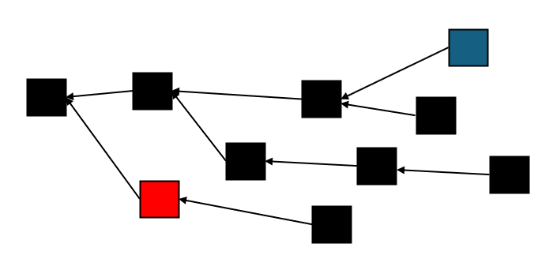

# Part 3: Proportional Reward Splitting

**Warning**: This post is [**a draft**](./). Please don't read it before reading [this](https://shai-deshe.gitbook.io/parallel-thoughts/drafts/drafts). For the parts that were already published as non-drafts, see [here](../../proof-of-work/fixing-bitcoins-incentive-alignment/).

> **Acknowledgement**
>
> This post was funded by the [Quai network](https://qu.ai/), which generously provided me with a grant to fund my proof-of-work education efforts.

We are finally ready to present the protocol that motivated this entire series, the [_proportional reward splitting_](https://arxiv.org/abs/2503.10185) (PRS) mechanism.

## Quick Recap

A recap of what we've seen so far, recast in the terms we learned along the way, will go a long way for properly framing PRS.

[In the first post](../../proof-of-work/fixing-bitcoins-incentive-alignment/part-i-bitcoin.md), we described _selfish mining_, a phenomenon first observed on Bitcoin by Eyal and Sirer, and explained how it leads to a security property known as _fairness._ We roughly defined fairness as the assertion that, over a sufficiently long period of time, the proportion of rewards collected by an $$\alpha$$-miner should converge to $$\alpha$$.

We noted that the selfish mining attack by Eyal and Sirer demonstrates that Bitcoin lacks the fairness property, even assuming an honest majority of miners!

This motivated Pass and Shi to create the FruitChains protocol, which we discussed at great length in [the second post](../../proof-of-work/fixing-bitcoins-incentive-alignment/part-2-fruitchains.md).

Pass and Shi manage to properly align the incentives, but their protocol has a strong technical caveat: the regimes of parameters in which its security analysis holds are highly impractical. In other words, in any possible instantiation, the _rate_ at which the $$\alpha$$ miner's fraction of the rewards converges to something close to $$\alpha$$ is _much too slow_.

This is an example of a problem that PRS _solves_.

A second property of FruitChains that we do not like is the necessity of the honest assumption. FC improves upon Bitcoin in that the honest strategy is rational, but it is not the _only_ rational strategy. In particular, the "only pack your own fruit" strategy is perfectly rational, but if a majority of miners follow it, FruitChain will revert to Bitcoin.

This is an example of a problem that PRS _doesn't solve_. In fact, it is the motivation for the currently ongoing further research, which we will touch on at the end of the post.

## The PRS Protocol

The key difference between PRS and FC is in the name: _proportionality_. In FC, _each fruit has the same reward_. However, in PRS, each _block_ has a fixed reward, and it is _split_ proportionally with the number of shares. As an implication, PRS (unlike FC) does not place transactions in the workshares, but in the blocks themselves. This is because the transaction fees should also be split proportionally.

This is a subtle yet profound difference: in FC, you know _exactly_ how much you get for each fruit by packing it. In PRS, each share has a _height_, and the reward for a block of a given height is split according to the number of shares of the same height that were included within a designated period of time.

Recall that FC had a single parameter that a designer could tweak: the freshness parameter $$R$$. PRS provides _two_ tweakable knobs: First, the _workshare-eligibility window_ $$W$$ plays a role similar (though not identical) to $$R$$. Second, the _fork-eligibility window_ $$k$$, whose job is to ensure that the number of shares at a given height becomes fixed sufficiently fast.

Our first task is to explain these rules.

### Workshare-Eligibility

In PRS, like FC, a workshare $$ws$$ is a "low difficulty" object that is supposed to represent a "unit of participation". Each workshare must contain a reference to a single _block_ that we denote $$ws.base$$. This _base block_ is nothing but an attestation to the time $$ws$$ was created, like taking a picture with today's newspaper. (Of course, $$ws$$ can point at _any_ block, as long as it already exists, but pointing at anything but the tip of the best chain only harms the miner.)

The purpose of workshare eligibility is to make sure that a block does not include "stale" workshares that are more than $$W$$ blocks old. This description might lead you to assume that the eligibility condition should be "For any workshare $$ws$$ that $$B$$ is pointing at, $$ws.base$$ is at most $$W$$ blocks below $$B$$", but that is not quite the case. The problem is that $$ws.base$$ is _not necessarily below_ $$B$$. Huh? Let's explain what's going on.

Unique chain inclusion assumption

For this definition to make sense, we also have to assume that if $$B$$ points at $$ws$$,  then no block below $$B$$ points at $$ws$$. Otherwise, we might consider $$B$$ invalid for pointing at a workshare that his grandparents already included. The paper does not make this assumption, and it is easy to generalize anything that we do to work without it, but it makes everything messier for no particular gain, so I am just going to make this assumption impliccitly

### Uncle Lovers

Consider the following situation:

<figure><figcaption></figcaption></figure>

As a miner planning their next, you might find yourself in a dilemma:

<figure><figcaption></figcaption></figure>

Stress not, miner! We love _uncle blocks_ here. This means that you are allowed to enjoy both worlds!

There is nothing preventing you from doing something like this:

<figure><figcaption></figcaption></figure>

The block A is called an _uncle block_ of B. This terminology is surprisingly exact. For $$A$$ to be an uncle of $$B$$ we must have that $$A$$ and $$B$$ are on separate chain, but that $$A$$ is higher than $$B$$. Just like how your (first) uncle was born in your parents' generation!

However, to truly accommodate uncles, we must make our definitions uncle-friendly.  (This is a good time to make sure you understand this point, and how things might have broken had we allowed uncle but stuck to the definition proposed above).

### Workshare-Eligibility Revisited

Adapting the definition is straightforward. For every block $$B$$, let $$h(B)$$ be its distance from the genesis block (it's "generation"). The workshare-eligibility rule requires:

> If $$B$$ points at $$ws$$, then it must be the case that $$h(B) \le h(ws.base) + W$$

This assures that blocks are allowed to point at workshares not based on their chain, as long as the height difference is within the parameter.

This means that workshares do not get lost even as a result of a reorg. As long as the reorg is shallow enough, the workshares based on the "wrong side" of the reorg are still usable. This already provides a strong intuition as to how PRS prevents the Eyal-Sirer attack: using withheld blocks to orphan honest blocks won't help you gain more profit, as the makeup of the workshares remains the same.

### Fork-Eligibility

Uncle blocks add, quite literally, a new dimension to our workshare supply. If we disregard uncles, then  all workshares are based on the same chain, which makes workshare-eligibility enough to seal the ability to add new shares to a sufficiently old block.

(sketch of dilution attack, explain the fork rule and how it resolves it)
