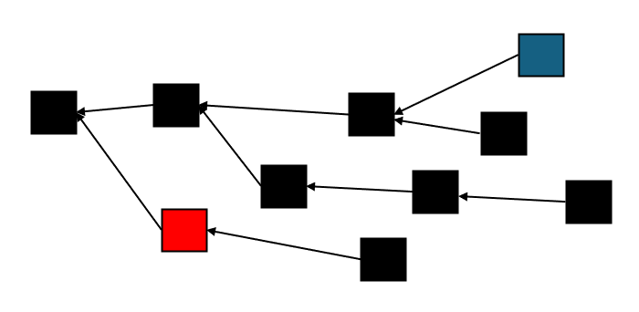

# Fruit, Shares, and Selfishness

> **Acknowledgement**
>
> This post was funded by the [Quai network](https://qu.ai/), which generously provided me with a grant to fund proof-of-work education.

In this post, we present two solutions for selfish mining, the Fruitchain bla bla bla

<figure><figcaption>
A shellfish miner
</figcaption></figure>

## Selfish Mining Primer

In a previous post, I explained [selfish mining in Bitcoin](https://shai-deshe.gitbook.io/pow-book/part-1-blockchains-and-blockdags/chapter-2-the-block-chain-paradigm/selfish-mining-in-bitcoin).

If you're not familiar with selfish mining, I suggest reading that post first. The executive summary is that the incentives in Bitcoin aren't exactly aligned with how we would like miners to behave.

The Bitcoin protocol assumes that _honest_ miners follow two simple rules:

1. Always mine over the top of the heaviest chain
2. Whenever you discover a new block (either by solving it yourself or hearing about it from one of your peers), broadcast it to all your peers _immediately_

In reality, we [do not expect miners to be honest, but _rational_](https://shai-deshe.gitbook.io/pow-book/part-1-blockchains-and-blockdags/chapter-2-the-block-chain-paradigm/honesty-and-rationality). We assume a majority of the miners in the network are seeking to maximize their Bitcoin profits from fees and mining. Under this assumption, we can influence miners' behavior by _incentivizing_ them.

The incentive in Bitcoin is straightforward: if your block is on the heaviest chain, you win fees and a block reward. It is not hard to believe that mining over any block but the top of the heaviest chain increases the chances that your block will be orphaned, thus decreasing your expected gain and encouraging miners to follow the first rule. The second rule doesn't align quite as nicely. It is rational for small miners to follow it, but as it turns out, sufficiently large miners can gain from _withholding_ (and potentially orphaning) blocks.

### How Eyal and Sirer Ruined Bitcoin Forever (but not really)

[In their paper](https://arxiv.org/abs/1311.0243), Eyal and Sirer present a strategy that increases the profit of a large miner by withholding blocks.

The idea is that by withholding the blocks they created, only releasing them at strategic times, a large miner can increase the orphan rates of the rest of the network more than its own orphan rates, causing their proportion of non-orphaned work to increase, whereby earning then a bigger cut of the reward than their coontribution to mining.

For those who want the details of the Eyal-Sirer attack, as well as an overview of the subsequent attacks and countermeasures, I recommend the [relevant section](https://shai-deshe.gitbook.io/pow-book/part-1-blockchains-and-blockdags/chapter-2-the-block-chain-paradigm/selfish-mining-in-bitcoin) of my book.

The upshot of the attack, in concrete number form, is summarized in this figure lifted from their paper:

<figure><figcaption>
(Fig 2. from Eyal-Sirer)
</figcaption></figure>

$$\gamma$$ measures _connectivity:_ the probability that an attacker block _wins_ (that is, not orphaned) if it releases at the exact same time the adversary hears of a competing honest block.

We see that even if we assume zero connectivity, an attacker with more than 33% can profitably carry out the attack, while as little as 44% suffices to create a _majority_ of the blocks non-orphaned.&#x20;

With perfect connectivity, 33% is already enough to create a majority of the non-orphaned blocks, and _any_ perfectly connected attacker has something to gain from a selfish mining attack.

The most realistic scenario is that the attacker's connectivity parameter is somewhere in between, say halfway. In this case we see that 25% are enough for a profitable attack, while 38% are enough to create a majority of non-orphaned blocks.

A common misconception is that because a 38% attacker can create a majority of the blocks, she can double-spend. It makes sense that by making more blocks than the honest network, you can create a competing chain, but that's _not what you do_ in selfish mining. The _total_ fraction of blocks remains the same, but you constantly headbutt with honest blocks to kick them off the chain. You can only do this by pointing at, or near, the heaviest tip, which is impossible if you spend your efforts on mining a side chain.&#x20;

A successful double-spend attack looks like this:

<figure><figcaption></figcaption></figure>

whereas a successful selfish mining attack looks like this:

<figure><figcaption></figcaption></figure>

Note that in the latter example, the red blocks constitute the majority of _chain_ blocks, but the blue blocks are still the majority of _all_ blocks.

### Chain Quality (and Lack Thereof)

A key nuance in the discussion above is that _we don't like selfish mining_, but it _doesn't allow a double-spend attack_. In other words, it is a behavior that is considered adversarial, but is not captured in the colloquial definition of [what makes a blockchain secure](https://shai-deshe.gitbook.io/pow-book/part-1-blockchains-and-blockdags/chapter-2-the-block-chain-paradigm/security-notions).

It is natural to [define a security notion](https://shai-deshe.gitbook.io/pow-book/part-1-blockchains-and-blockdags/chapter-2-the-block-chain-paradigm/security-notions) that captures selfish mining attacks. That is exactly what Garay, Kiayias, and Leonardos did when they described the [Bitcoin backbone protocol](https://eprint.iacr.org/2014/765), a version of Bitcoin that is simplified enough for mathematical analysis, but more accurate than previously used models.

In that paper, they introduce the _chain quality_ property. The precise definition is a bit technical, but the gist is this:

**Definition** (reproduced from Definition 4 in [GKL](https://eprint.iacr.org/2014/765), simplified, informal): A blockchain has the chain quality property if the amount of non-orphaned blocks produced by a miner with a fraction $$\alpha$$ of the global hashrate gets closer to a fraction of $$\alpha$$ of the blocks as time passes.

The key hidden detail here is how long we need to wait before the fraction becomes sufficiently close to $$\alpha$$. GKL did not answer this question for a straightforward reason: Bitcoin does _not_ satisfy the chain-quality property.

### Selfish Generals?

In my experience, what I am about to explain in the following section shatters the way many people view Bitcoin's security properties.

The following statements are facts:

1. Deterministic finality [cannot handle a situation where more than a third of the nodes are faulty](https://shai-deshe.gitbook.io/pow-book/part-1-blockchains-and-blockdags/chapter-1-bft-vs.-pow/byzantine-fault-tolerance).&#x20;
2. In particular, BFT protocols cannot guarantee that they reach an agreement if close to half of the nodes allow themselves to deviate from the protocol
3. In Bitcoin, we only need (slightly more than) half of the miners to be honest to assure consensus is reached in a timely manner and becomes irreversible fast

It is natural to assume that in this case, we can also use Bitcoin for binary voting: just let each miner post a "yes" or "no" on their blocks and then do a majority count.

Selfish mining proves that this is not the case: a sufficiently connected 34% attacker can create a majority of the blocks and win the vote.

Apparently, while it is true that Bitcoin can handle a higher fault threshold, the property that a collusion of more than a third of the voters could always create a majority of the blocks _persists_. In particular, for _any protocol,_ including probabilistic ones, a _perfectly connected adversary_ with more than a third of the global hashrate could _always_ produce a majority of the blocks.

So why are we even doing this?

Because the assumption of a perfectly connected adversary is unrealistic. Remember, a perfectly connected adversary has the following property: if the adversary withholds a block $$B$$, and then upon hearing about a competing block $$C$$ releases block $$B$$, they are _guaranteed_ that the network will prefer $$B$$ over $$C$$.

It's hard to imagine such an adversary in reality. Even for a very well-connected adversary, there must be some other miner sufficiently distant that, by the time the attacker learns of their blocks, most honest miners also have, giving the attacker's block a _zero_ chance to win.

Furthermore, the ability to selfishly mine becomes quite limited quite fast as the connectivity parameter $$\gamma$$ becomes smaller. This is already apparent in the Eyal-Sirer graph above. However, we see that for low (even zero) values of $$\gamma$$, a sufficiently larger less-than-half adversary can still accrue disproportionate gains.

Fixing _this_ is the problem that inspired the protocols we are about to discuss.

## Unselfishing Bitcoin?

The aftermath of the discovery of selfish mining has led to various approaches for mitigating its effects. As usual, the Bitcoin community was averse to modifying the underlying protocol. Some suggested changes to peer-to-peer policies (such as block relaying and tie-breaking rules) that, while not prohibiting the attack, would make it harder to carry out. Others argued that selfish mining is not a significant concern, given the extreme measures required to carry it out profitably.

On the theoretical front — where the motivation is not the preservation of Bitcoin, but understanding what probabilistic consensus can or cannot do — people work on developing protocols where this problem does not exist.

In the remainder of this post, I will present two such protocols.

The first protocol is called [_FruitChains_](https://eprint.iacr.org/2016/916)_._ Introduced in a 2016 paper by Paas and Shi, selfish mining rightfully claims to be the first protocol to solve selfish mining, and for a good reason. However, since its inception almost a decade ago, no projects have attempted or declared any intentions to implement it, and for a good reason: the trade-offs it proposes are unreasonable. Theoretically, it is great, but when you try to translate the asymptotics provided by theory to an actual implementation, you find that implementing the protocol requires unreasonably delaying how long miners have to wait before they are rewarded.

Following FruitChains, the selfish mining resilience frontier remained fairly stagnant. That is, until \[ask Quai guys to fill in the blank]. They came up with a variation of FruitChain called [Proportional Reward Splitting](https://arxiv.org/abs/2503.10185) (PRS). PRS  can reduce the reward chilling periods by orders of magnitude, furnishing the first _practical_ approach to solving selfish mining.

However, PRS is not yet a complete solution: it can only provide _partial incentive alignment_. Let's take a moment to understand what this means.

### Classifying Misalignment

Recall that our discussion is from the prism of _mechanism design_, which means we want to _align_ the _rational_ behaviour induced by the incentives with the _honest_ behavior we want miners to follow.

We can classify protocols into two categories: aligned and misaligned. But this dichotomy is far too coarse. It turns out, there are quite a few different ways to be aligned or misaligned. Let us count the ways to be aligned:

* A protocol is _perfectly aligned_ if the _only_ rational strategy is the honest one. Many consider this too good to be true.
* A protocol is _sufficiently aligned_ if the rational strategies are "close enough" to the honest behaviour. Formally speaking, those who declare selfish mining "not a concern" due to its insignificance for all but huge miners are actually arguing that Bitcoin is sufficiently aligned.
* A protocol is _approximately aligned_ if (by a choice of parameters) we can make it as close to perfectly aligned as we want. In theory, this is considered the gold standard. The only protocol that is currently proven to be approximately aligned is FruitChains. However, there's always a gap between theory and practice, and FruitChain falls into this gap. While it can approximate perfect alignment with arbitrary quality, obtaining even reasonable approximations requires using unrealistic parameters. In simpler words: significantly reducing selfish mining is possible, but it requires delaying the distribution of block rewards by _weeks_.

And what about the way not to be aligned? Is there a difference between "not being aligned" and "being misaligned"? There is! And it is an important distinction:

* A protocol is _misaligned_ if rational strategies are "too far" from honest behavior. Being misaligned is the complement of being sufficiently aligned. Calling it "not sufficiently aligned" might have been more accurate, but it would also be a mouthful. There is no formal, unambiguous way to determine what "close enough" is, and agreeing on where the line should cross can become quite contentious. In fact, I might argue that the majority of arguments about blockchain security are, deep inside, arguments about whether a particular protocol is sufficiently aligned or not.
* A protocol is _partially aligned_ if the honest strategy is (approximately) rational, but _there are other rational strategies_. The incentive structure prohibits many dishonest strategies, _but not all of them_. This is not necessarily a bad thing; it could very well mean that you are in the right direction, though not quite there yet.&#x20;

I would currently classify PRS in the latter category. It provides a way to arbitrarily reduce selfish mining efficiently. However, the apparatus it sets up provides miners with a new dimension of choice that we'd rather they not explore. The incentives don't _encourage_ this kind of behavior, but they don't _penalize_ it either. Better yet, the set of rational strategies is tame and well-contained, showing that PRS is, in the very least, a major step towards a sufficiently aligned, practical protocol. Further yet, once we describe exactly what these strategies are, you will notice it is actually not too hard to come up with compelling, plausible fixes.

This is where the publicly available research on PRS gets us, but in closed conversations (that I was permitted and even emphatically encouraged to share publicly), I've learned quite a lot about (and hopefully contributed a little to) the solution they are working on.

The direction is natural, but introduces crucial subtlteties that must be treated with the proper finesse.

### Marco? Polo!

Mining pools actually have to face a very similar problem. In a mining pool, multiple miners collaborate to produce a single block. Despite their cooperation, only _one of them_ produces the winning nonce, so how can you divide the reward?

Think about it like a search excavation looking for a lost treasure. (Make sure you follow the analogy, because we'll be building on it.)

To keep things fair, the members of the excavation decide that if they find the treausure, they will split it such that each member is rewarded in proportion to the amount of ground she covered during the search. How can they keep track of that, so they could know how to split the reward?

Based only on knowing who found the treasure, _they_ _can't_. The finder might have done most of the work, or their fair share of work, or maybe they were extremely lucky and found the treasure in the first place they looked. If the only information you have is who found the treasure, all three scenarios are _indistinguishable_.

So, you need additional information, but what kind of information? Imagine this: before the search starts, the excavation manager flies over the search area in his helicopter, from which he throws a million plastic tokens that scatter randomly across the landscape.

Now, each member of the search excavation can collect these tokens as they encounter them, giving a rough approximation of how much land they covered. If the treasure is eventually found, each member will get a share equals to the share of token they found out of all _found_ tokens. For example, if Alice, Bobette, and Charline found 3, 5, and 7 tokens, then Bobette will get a fraction of  $$5/(3+5+7)$$, or _one-third,_ of the treasure. Note that we only divide by the number of _found_ tokens.

Recall that [in proof of work](https://shai-deshe.gitbook.io/pow-book/part-1-blockchains-and-blockdags/chapter-1-bft-vs.-pow/how-pow-works) you keep hahshing different nonces until you find one whose hash is smaller than some number $$T$$ (called the _difficulty target)_, where hashing each nonce outputs a _uniformly random_ number between $$0$$ and $$N-1$$ for some huge $$N$$ (typically, $$N=2^{256}$$).

In our search excavation analogy, the members are miners, the ground they cover is the nonces they tried, and a treasure is a nonce that hashes to a number smaller than the difficulty target, but what are the plastic tokens?

An ubiquitous way to capture them is in terms of something called a subblock. Say that we are looking for a nonce below the difficulty target $$T$$, how many nonse that hash below $$2T$$ do we expect? Well, since the hash value is uniformly random, hashing below $$2T$$ is _twice as likely_. So we expect to find _two_ such nonces along the way. More generally, if we churn nonces until we find one that hashes below $$T$$, for any $$x$$ we expect to find $$x$$ nonces that hash below $$xT$$.

It is most common to express $$x$$ as a power of two. For any $$k$$, if the difficulty target is $$T$$, then a $$k$$-_subblock_ is any block whose hash is below $$2^k\cdot T$$.

**Remark**: The reason it is defined like this, and not simply as $$k\cdot T$$, is that it is technically easier. In proof of work it is often more natural to talk in terms of _entropy_, which essentially counts _bits_. If $$T$$ happens to be a power of two, $$T=2^m$$, then saying that the output is "smaller than $$T$$" is saying that all digits in the output, except perhaps the least $$m$$ digits, are zero. We allow a $$k$$-subblock to be $$2^k$$ times larger, which means we soften the requirement to allow the least $$m+k$$ digits to be non-zero. That is, a $$k$$-subblock is required to have $$k$$ zeros less than a valid block..

Say we set $$k=10$$, then finding a $$k$$-subblocks is $$2^{10} \approx 1000$$ easier than finding a block. In other words, we expect about a thousand $$k$$-subblocks to be found in the process of looking for the block. Moreover, the number of subblocks each miner finds should be proportional to the fraction of the work they did. Just like an excavator that covered a twice larger area will find roughly twice as many plastic chips.

**Exercise**: The analogy I made is not entirely accurate. Can you spot the lie? Assuming that we want to modify the protocol to match the analogy, how would you fix this?

Hint

Think about how shares distribute with respect to blocks. Now, think about how plastic chips distribute with respect to treasures.

Answer

Note that in our definition, a _block is always a subblock_. We defined a $$k$$-subblock as having a hash below $$2^k\cdot T$$, and a block as having a hash below $$T$$. Clearly satisfying the latter term implies satisfying the former.

In our analogy, a "block" is a treasure, and a "subshare" is a chip. However, it is possible to find a treasure without finding a chip! Fixing the analogy means making sure there is a chip in every treasure chest. However, we actually prefer to go the other way, and fix the protocol to match the analogy. Why? Because generally speaking, unneeded dependencies should be avoided, and there's no good reason to insist on retaining a dependency between blocks and shares we can easily remove.

We can remove this by using what's known as the "two-for-one PoW trick". To check if a nonce gives a block, hash it and check whether the result is smaller than $$T$$. To check if a nonce gives a share, hash it, _reverse the result_ (when written as a binary string), _flip its bits_, and check whether the result is smaller than $$2^k\cdot T$$. The idea is that when checking for one thing, we use the rightmost bits, and when checking for the other, we use the leftmost bits. That is, for one purpose we read the number left-to-right, and for the other we read it right-to-left.

If we assume $$2 \log(T) + k \ll \log(N)$$, we get that the dependency between being a block and being a share is overwhelmingly small. The details are left as a recommended exercise in elementary probability theory.

So now the problem seems rather simple, right? Just ask miners to send over their subblocks (which in this context are more commonly called _shares_) to the pool operator, and tally them to divide rewards.

Well, it's not that simple. This protocol allows pool operators to cheat. They have no accountability for "losing" some of the shares or lying about shares that do not exist. There is an entire family of protocols designed to reduce the trust element, including PPS+, PPLNS, FPPS, and others.

However, remember that we don't want to build a mining pool; we want to counter selfish mining. So what if we ask each miner to attach all shares they found while mining, and divide the prizes proportionally to the share count? We don't need any trust here, because the shares must be _on-chain_ and thus verifiable by _everyone_. This observation inspired the first protocol we will examine.

## Grab Me a Fruit, Will Ya?

